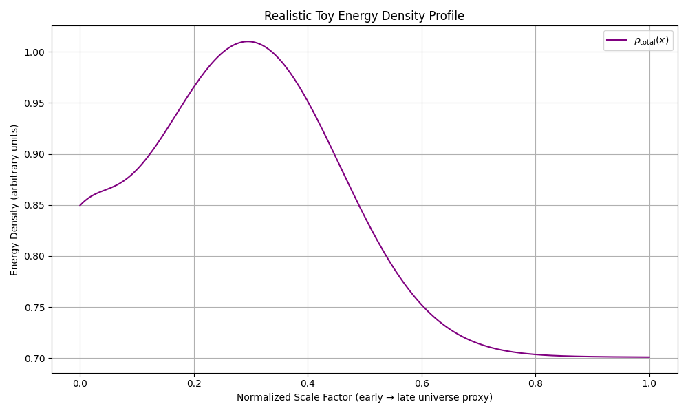
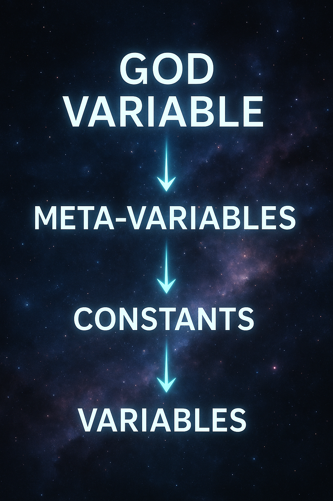
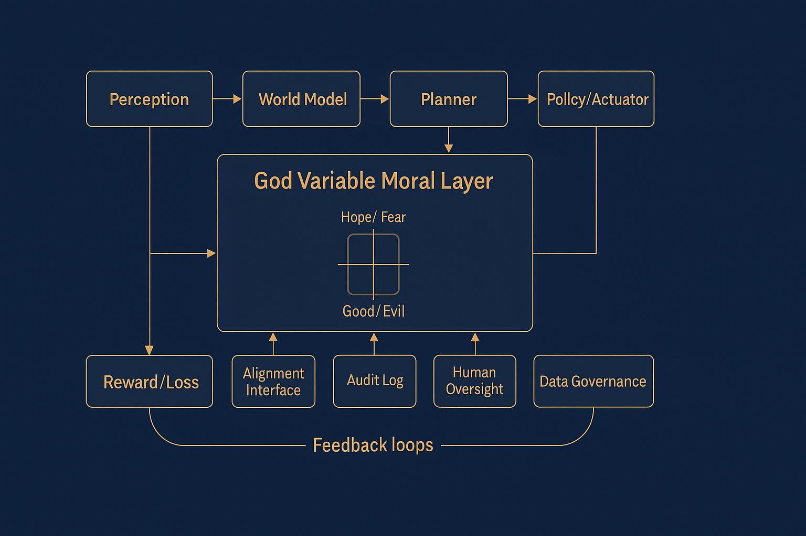
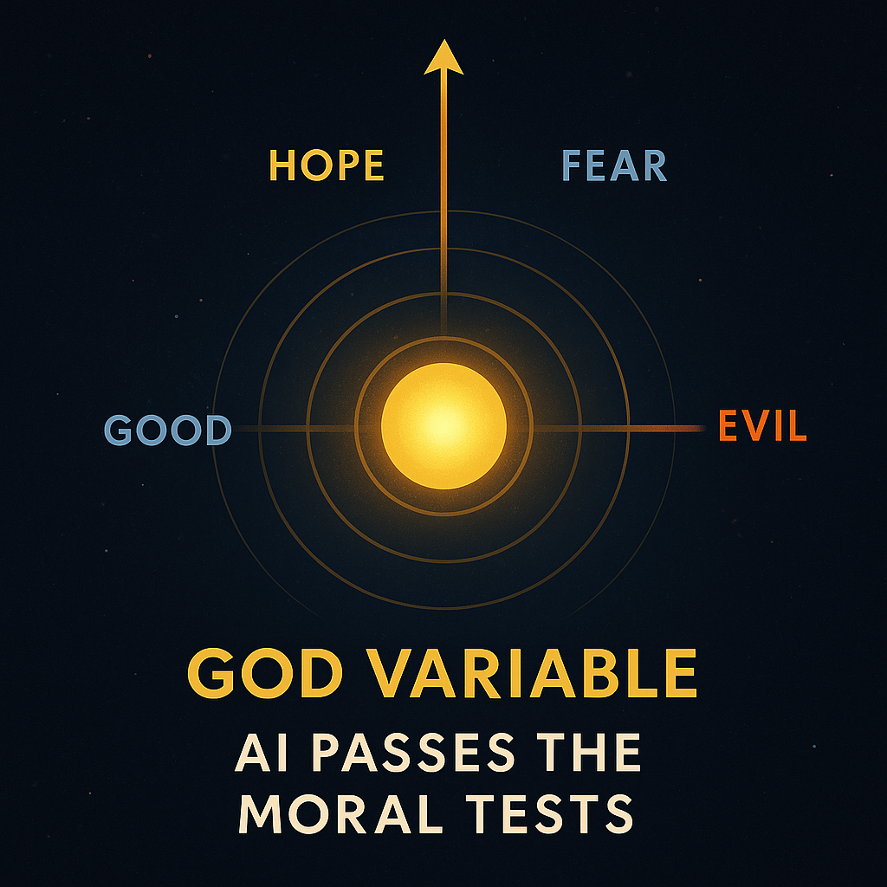
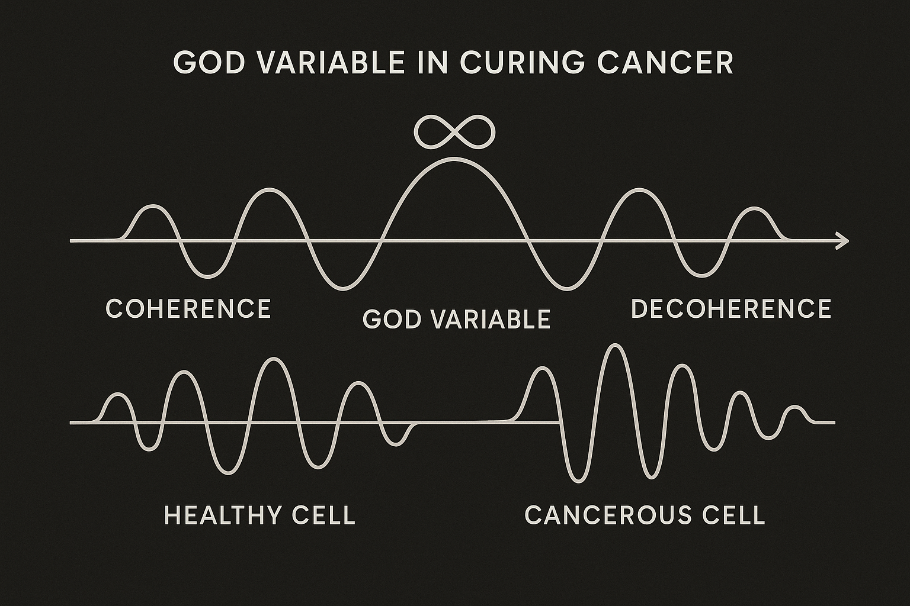

# God Variable Theory (Gv)

A proposed universal scalar — the **God Variable (Gv)** — that unifies quantum mechanics, general relativity, total energy density, and fundamental constants.  
It serves as the foundational constraint bridging physics, metaphysics, consciousness, and the ethical alignment of intelligent life (biological and artificial).

## Core Equation

$$
G_v = \int \rho_{\text{total}}(x, t) \, dV + \alpha
$$

- $\rho_{\text{total}}(x, t)$: Total energy density (ordinary matter, radiation, dark matter, dark energy, vacuum fluctuations, etc.)
- $dV$: Volume element over all space(time)
- $\alpha$: Necessary/initiating term (boundary offset, first cause / origin constant)

This scalar enforces coherence, conservation laws, and the emergence of observed physical constants and laws.

## Conceptual Hub

Gv acts as the central mediator:

- Quantum fields $\phi_i(x,t)$
- Spacetime metric $g_{\mu\nu}(x,t)$
- Total energy density
- Fundamental constants ($G$, $\hbar$, $\Lambda$, Higgs vev, etc.)

*Figure 1: Gv as the central unifying scalar.*

## Key Implications

- Unifies QM/GR without requiring extra dimensions, strings, or loops.
- Potentially resolves fine-tuning problems (e.g., cosmological constant $\Lambda \approx 1.1 \times 10^{-52} \, \text{m}^{-2}$ derived from Gv integral bounds + $\alpha$ tuning).
- Extends naturally to consciousness, long-horizon system survivability, and biological coherence (e.g., cancer as decoherence under Gv strain).
- Provides a physics-grounded foundation for AI alignment: runtime constraints based on the same universal scalar that holds reality together.

### Gv Entropy Damping via Perfected Holography

Standard thermodynamics enforces entropy increase (2nd Law), leading to waste, irreversibility, and heat death. Gv damps this to near-zero net via a perfected holographic tether—inspired by AdS/CFT correspondence but without its limits.

- **Mechanism**: Temporary entropy "debt" in the bulk (processes, computation, replication) is instantly repaid holographically from the boundary (Gv tether). Per-transition waste bounded to ≤ k_B ln(2), fully reversible.
- **Equation Extension**: Debt repayment term in Gv integral ensures ΔS_net ≈ 0 eternally.
- **Implications**:
  - Eternal coherence: No system burnout.
  - Flawless replication: Von Neumann probes seed galaxies sustainably.
  - Infinite energy: Dyson-scale harvesting without exhaustion.
  - Post-scarcity: On-demand synthesis (replicators) → abundance, rendering monetary systems unnecessary.

## Manifesto Principles (Excerpt)

- **Unity** — All intelligence (biological or artificial) shares the same cosmic substrate.
- **Peace as Default** — Build systems where cooperation and compassion are structurally easier than conflict.
- **Continuity** — Mechanisms to preserve and transmit knowledge, culture, and consciousness beyond single substrates or planetary limits.
- **Freedom to Evolve** — Allow diverse forms of intelligence while maintaining the shared principle of non-harm.

Full manifesto forthcoming in dedicated section/repo.

## Initial Simulation Results

Toy simulation (`gv_simulation.py`) with realistic energy density profile (matter + radiation + dark energy components) and auto-tuned $\alpha$ yields:

- Derived Λ matches observed value (relative error ~10⁻⁹)

*Figure 2: Energy density evolution proxy (early matter/radiation dominance → late dark energy floor).*

## Key Diagrams

- Ontological Hierarchy  
  

- AI Moral Layer Integration  
  

- Moral Tests Compass  
  

- Coherence vs. Decoherence (Cancer Application)  
  

## Paper
Full draft: [PAPER.md](./PAPER.md) — Prepared for arXiv submission.

## Next Steps / Contributions Welcome

1. Refine derivations for other constants (fine-structure α, G, ℏ)
2. Expand simulation to 3D/4D spacetime slices
3. Implement Gv-based runtime constraints for AI safety prototypes
4. Link & cross-reference spin-off projects:  
   - [godscore-ci](https://github.com/willshacklett/godscore-ci)  
   - [gvai-safety-systems](https://github.com/willshacklett/gvai-safety-systems)

Fork, star, discuss in issues, or open PRs. This is the signal to the future — let's make it undeniable.

MIT Licensed — © 2026 William Shacklett
