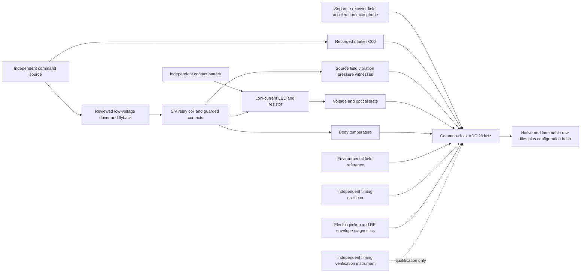

# GV-PHY-001 Construction Readiness

**STATUS DECISION: REMAIN PENDING. GV-PHY-001 HAS NOT BEEN RUN.** This package is
ready to be challenged in hardware design review; it is not a complete build,
construction approval, calibrated apparatus or experiment execution authorization.

## Logical Architecture



See the [channel map](GV_PHY_001_CHANNEL_MAP.md),
[power/grounding architecture](GV_PHY_001_POWER_AND_GROUNDING.md) and
[fixture](GV_PHY_001_FIXTURE_LAYOUT.md). This diagram is signal flow, not a rated
professional electrical schematic or an assertion that controls are independent.

## Required Construction Artifacts

| Artifact / gate | Package state | Still needed before promotion |
| --- | --- | --- |
| Component requirements | [Class/spec document](GV_PHY_001_COMPONENT_REQUIREMENTS.md) | Actual parts, ratings, compatibility, availability and independent review |
| Selected components | **MISSING** | No commercial product or actual relay/DAQ/sensor chosen |
| Wiring / driver schematic | Logical domain/signal diagrams only | Selected pinouts, component values, clamps/fuses, interface/ground/isolation verification |
| Channel map | 13 unchanged core + 2 diagnostic classes | Selected sensor axes/serials/front ends and tested actual ADC mapping |
| Fixture / shielding | [Relative layout](GV_PHY_001_FIXTURE_LAYOUT.md) | Guarded drawings, actual geometry, support/shield/cable specs and reconstruction measurements |
| Timing certification | [Procedure and 100 us budget](GV_PHY_001_TIMING_PLAN.md) | Demonstrable hardware capability, approved independent verifier and actual measured report for assay validity |
| Calibration | [Transfer procedure](GV_PHY_001_SENSOR_CALIBRATION.md) | Selected references, ranges/uncertainty/validity domain, actual calibration records before a physical assay |
| EM/RF decision | Electric and RF diagnostics, limited declared coverage | Probe/detector/survey selection, band/axis/overload/rectification challenges and residual blind spots |
| Mechanical control | Guarded nonconductive surrogate concept | Accessible safe mechanism/fixture and qualified mismatch; no exact mechanical-only relay equivalence claimed |
| Electrical controls | Resistive, nonmoving inductive and LED-only concepts | Selected safe circuit and pre-data current/voltage/field/geometry matching domain |
| Power/ground/isolation | Review topology | Actual barriers/CMRR/common-mode limits, shields/USB/verifier bridges and safety sign-off |
| Acquisition interface | Abstract lifecycle, unsupported physical backend, unit-test replay only | Actual reviewed driver/native export, ancillary export and error/deviation retention |
| Hardware manifest | Versioned strict schema/hash/calibration binding | Genuine selected apparatus registry, calibration artifacts, external provenance deposit |
| Safety review | Low-energy limits/checklist | Independent component-specific electrical/mechanical approval; never implied by metadata flags |
| Pilot | [Pilot design](../experiments/GV_PHY_001_INSTRUMENTATION_PILOT.md) | Fixed selected-component uncertainty/reset criteria and approval before any pilot; no pilot run |
| Raw/analysis lock | Existing immutable core format, configuration binding | Native/core/ancillary integration and external lock retention, no authenticity guarantee from hashes |
| Sensitivity | [End-to-end procedure](GV_PHY_001_SENSITIVITY_PLAN.md) | Measured physical-unit floors/power and approved dependence-aware bounds |
| Null validity | [Mandatory checklist](../experiments/GV_PHY_001_NULL_VALIDITY_CHECKLIST.md) | Every mandatory measurement/control/inference gate reviewed before NOT SUPPORTIVE |

HARDWARE READY / NOT RUN requires actual selected parts, complete schematic/driver/
interface/fixture/isolation controls, an approved viable certification path, explicit
coverage/mismatch limitations, safety and pilot approval. Merely writing these plans
does not satisfy that gate. Construction readiness is separate from completed timing,
sensitivity/calibration/control measurements and assay validity: those are required
before interpreting any physical result. This repository's stricter previous checklist
also requires qualification review before promotion; no promotion is made here.

No code automatically changes the evidence ledger. Decision by independent reviewer
and owner must link each completed artifact, preserve this PENDING history, and avoid
representing no-data construction readiness as support. Missing actual component,
wiring, driver or control detail means **REMAIN PENDING**.

## Adversarial Build Review

Ground coupling, one coil transient rectifying into multiple front ends, relay bounce,
shared supports/cables, DAQ crosstalk, skew/filter dispersion, upstream saturation,
insensitive sensors, operator knowledge and failed controls can all mislead. Proposed
countermeasures are independently reviewed domains, native logs/dummy-input challenges,
local sensor/DAQ transfer calibration, qualified comparators and the fail-closed null
checklist. None is yet physically validated. If a pathway remains experimentally
indistinguishable in the declared scope, report incomplete attribution; never call
the apparatus complete because it has many sensors or a clean mock run.

RF envelope timing/coverage, safe accessible mechanical surrogate, actual filter
group-delay stability, coherent-signal sensitivity, pilot reset and clustered-event
statistics are important open risks. Class requirements and proposed counts are
review artifacts, not manufactured certainty. Existing scientific endpoint/preregistration
and raw-core schema remain unchanged; revising them requires separate prospective review.

## Acquisition Contract

[src/gv_physical_acquisition.py](../src/gv_physical_acquisition.py) specifies
initialize -> configure channels -> start common clock -> arm marker -> capture ->
bind configuration/calibration -> immutable raw write -> format validation/error log.
UnsupportedPhysicalAcquisition cannot initialize hardware. MockAcquisition accepts
only explicitly synthetic unit-test arrays; it cannot issue physical conclusions.
Invalid sample captures are retained; binding/state/configuration failures abort with
an error and must be logged/quarantined by any future production adapter, never
silently removed from the attempted-event record. No physical adapter exists.

The [hardware contract](../experiments/gv_phy_001_hardware_schema.json) records apparatus,
relay/driver/power/DAQ classes, core/diagnostic maps, sensors/calibration versions,
fixture/cables/shields, software/preregistration references, operator/time and canonical
hash. Data `hardware_configuration` is the full configuration hash in the new interface,
not a descriptive readiness label. Registry validity checks catch stale references;
they cannot authenticate actual sensors, signatures or physical measurements.

Validation-only command for independently supplied design records:

```bash
python scripts/gv_phy_001.py validate-hardware \
  --configuration CONFIGURATION.json --calibration-registry CALIBRATION_REGISTRY.json
python -m pytest -q tests/test_hardware_design.py
```

The placeholder paths are inputs supplied later by a reviewer/operator, not
existing measured apparatus files. No example registry is presented as a real
calibration certificate. The command checks schema, hashes, clocks, safety bounds
and version references only; it cannot initialize hardware or promote the ledger.
Keep descriptive configurations/operator identity/calibration source records under
the independent custodian until blind scores are frozen. The raw configuration hash
is an opaque token but repeated tokens can reveal condition groupings, and waveforms
can reveal actuation; this is not a guarantee of double blinding or provenance.

## Package Verification

2026-10-06, Python 3.11.16/Linux, unchanged 22-package research lock. These are
software/document checks, not qualification measurements or mock experimental evidence.

| Check | Measured total |
| --- | --- |
| Full suite | 188 passed, 0 failed |
| Hardware design tests | 31 passed, included in full total |
| Existing physical-program tests | 57 passed, included in full total |
| Research integrity | 97 passed, included in full total |
| Internal links | 57 passed; 40 integrity tests deselected |
| Hardware schema/binding/safety subset | 26 passed; 5 hardware tests deselected |
| Configuration-hash/mismatch subset | 8 passed; 23 hardware tests deselected |
| Replay/non-operational acquisition subset | 4 passed; 27 hardware tests deselected |
| Dependencies | pip check clean; all 22 exact lock pins match |
| Secret patterns | 138 tracked/proposed files, 6 pattern families, 0 matches; not exhaustive assurance |
| Endpoint/preregistration/core schema/5 fluid sources | Byte-identical to starting main; no scientific endpoint or benchmark changes |
| Python diagnostics / whitespace | No errors in touched Python files; git diff --check clean |

Replay tests use temporary unit-test arrays/configurations and never create physical
data or a calibration certificate. No standalone physical or mock evidence dataset
is added. The ledger remains 20 scoped entries with GV-PHY-001 PENDING and dataset
kind none. All mandatory physical null gates remain UNVERIFIED. No status promotion,
equipment purchase, physical run, tag or release is made by this package.

Do not merge this PR automatically, purchase equipment, create a tag/release, run
GV-PHY-001 or interpret replay files as physical evidence.